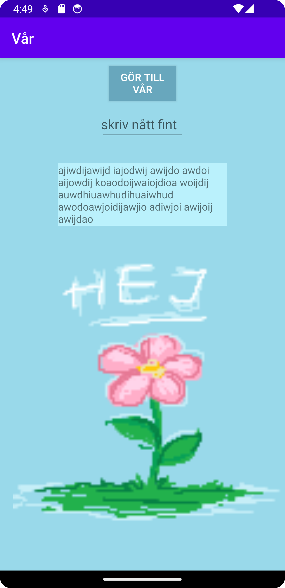

# Rapport

**Skriv din rapport här!**

_Du kan ta bort all text som finns sedan tidigare_.

## Följande grundsyn gäller dugga-svar:

- Ett kortfattat svar är att föredra. Svar som är längre än en sida text (skärmdumpar och programkod exkluderat) är onödigt långt.
- Svaret skall ha minst en snutt programkod.
- Svaret skall inkludera en kort övergripande förklarande text som redogör för vad respektive snutt programkod gör eller som svarar på annan teorifråga.
- Svaret skall ha minst en skärmdump. Skärmdumpar skall illustrera exekvering av relevant programkod. Eventuell text i skärmdumpar måste vara läsbar.
- I de fall detta efterfrågas, dela upp delar av ditt svar i för- och nackdelar. Dina för- respektive nackdelar skall vara i form av punktlistor med kortare stycken (3-4 meningar).

Programkod ska se ut som exemplet nedan. Koden måste vara korrekt indenterad då den blir lättare att läsa vilket gör det lättare att hitta syntaktiska fel.

LinearLayout

Ändrade namn på appen via kodraden nedan, funnen i strings.xml
```
    <string name="app_name">Vår</string>
```
Lade till en LinearLayout via kodraden nedan. Notera att alla kommande widgets nedan är placerade innuti LinearLayouts-brackets, och inkluderas
och faller därmed under dess regler.
```
<LinearLayout
        android:layout_width="match_parent"
        android:layout_height="match_parent"
        android:orientation="vertical"
        tools:ignore="MissingConstraints">
```
Lade till en knapp via "<Button", vilket gav mig ett par options. Dessa bygdes på under projektets gång, där de markanta kodraderna
kan sägas vara de nedan (notera att det finns mer kod till knappen). Här flyttar vi knappen till "mitten", ändrar dess bakgrund till blått,
Sätter text-färgen i knappen till vit, samt ger knappen ett id.
```
            android:layout_marginHorizontal="150dp"
            android:background="#68A7BD"
            android:textColor="@android:color/white"
            android:id="@+id/theButton"
```
Detta id:t används sedan i MainActivity för att registrera knapptryck via en 
listener. (for the sake of future implementation)
```
springButton.setOnClickListener(new View.OnClickListener() { ... }
```

Lade till en inteagerbar text-flik, genom "<EditText". Även här använde jag mig utav margin för att sätta textfältet i 
"mitten" utav skärmen. notera att kodraden nedan är inkluderad endast för att varningarna störde mig, men i verkligheten
används den för att berätta för autocorrection vilken information som den ska ge.
```
android:autofillHints="view."
```
En Vanlig text-view lades till på samma sätt som de tidigare widgetsen, vilken jag även satte i mitten av skärmen. Notera att jag bytte bakgrundsfärg
genom att ändra i colors.xml, se kodraden nedan
```
<color name="colorAccent">#BAF1FC</color>
```

Jag lade sedan till en bild, genom ImageView. På denna ändrade jag både width och height, till samma då bilden var en fyrkant. 
Detta gjordes via Layout_height, se nedan. Notera även att en contentDescription lades till för att bidra med en "ord-förklaring till bilden"
```
android:layout_width="410dp"
android:layout_height="410dp"
android:layout_marginTop="40dp"
android:contentDescription="En rosa blomma"
```
För att lägga till png:n gick jag in på View > Tool windows > Resource manager, och drog sedan in png:n till fönstret.
Efter detta skrev jag in pngs filväg (innehållande namnet) i ImageView, genom kodraden nedan. Notera att namnet är art.
```
app:srcCompat="@drawable/art"
```
Då Bilden och appens bakgrund inte passade, passade jag även på att ändra bakgrundsfärg på appen genom att lägga till kodraden
nedan till LinearLayout.
```
android:background="#99D9EA"
```


Bilder läggs i samma mapp som markdown-filen.



Läs gärna:

- Boulos, M.N.K., Warren, J., Gong, J. & Yue, P. (2010) Web GIS in practice VIII: HTML5 and the canvas element for interactive online mapping. International journal of health geographics 9, 14. Shin, Y. &
- Wunsche, B.C. (2013) A smartphone-based golf simulation exercise game for supporting arthritis patients. 2013 28th International Conference of Image and Vision Computing New Zealand (IVCNZ), IEEE, pp. 459–464.
- Wohlin, C., Runeson, P., Höst, M., Ohlsson, M.C., Regnell, B., Wesslén, A. (2012) Experimentation in Software Engineering, Berlin, Heidelberg: Springer Berlin Heidelberg.
